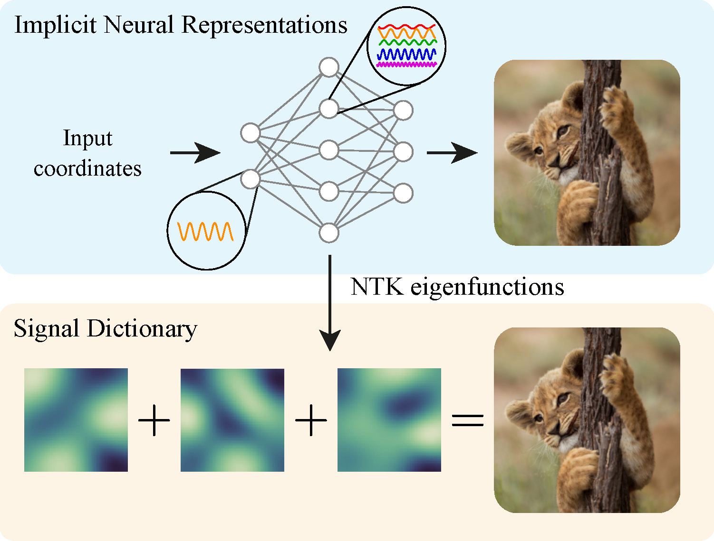

# A Structured Dictionary Perspective on Implicit Neural Representations

This is the source code to reproduce the experiments of the CVPR 2022 paper "[A structured dictionary perspective on implicit neural representations](https://arxiv.org/abs/2112.01917)" by Gizem Yüce*, Guillermo Ortiz-Jimenez*, Beril Besbinar and Pascal Frossard.



## Dependencies

To run the code, please install all its dependencies by running:
``` sh
$ pip install -r requirements.txt
```
This assumes that you have access to a Linux machine with an NVIDIA GPU with `CUDA>=11.1`. Otherwise, please check the instructions to install JAX with your setup in the [corresponding repository](https://github.com/google/jax#installation).

## Experiments

The repository contains code to reproduce each figure in the paper, as well as to pretrain a SIREN on the CelebA dataset using meta-learning:

- [Figure 2: Imperfect reconstruction <a id="imperfect_reconstruction"></a>](#figure-2-imperfect-reconstruction-)
- [Figure 3: Aliasing <a id="aliasing"></a>](#figure-3-aliasing-)
- [Figure 4: NTK alignment <a id="ntk_alignment"></a>](#figure-4-ntk-alignment-)
- [Figure 5: NTK eigenvectors <a id="eigenvectors"></a>](#figure-5-ntk-eigenvectors-)
- [Meta-learning pretraining<a id="meta-learning"></a>](#meta-learning-pretraining-)

### Figure 2: Imperfect reconstruction <a id="imperfect_reconstruction"></a>

Figure 2 shows examples of imperfect reconstruction of an image using INRs with a limited frequency support. To reproduce this figure you can run
``` sh
$ python figure_2.py
```
This script will save the resulting pdf figures under `figures/figure_2/`.

### Figure 3: Aliasing <a id="aliasing"></a>

Figure 3 shows an example of induced aliasing when reconstructing an ambiguous single-tone signal using an INR with a high-frequency emphasis. To reproduce this figure you can run
``` sh
$ python figure_3.py
```
This script will save the resulting pdf figures under `figures/figure_3/`.

### Figure 4: NTK alignment <a id="ntk_alignment"></a>

Figure 3 compares the alignment of the eigenvectors of the NTK at initialization with 100 CelebA images for different INR architectures. To reproduce this figure you can run
``` sh
$ python figure_4.py
```
This script will save the resulting pdf figures under `figures/figure_4/`.

> :warning: **Need to run `meta_learn.py` first!** `figure_4.py` assumes that you have access to the pretrained weights of a meta-learned SIREN. In this repository, we provide such weights for our default hyperparameters. However, if you want to experiment with other configurations, you will need to run `meta_learn.py`.

### Figure 5: NTK eigenvectors <a id="eigenvectors"></a>

Figure 5 plots the eigenvectors of the NTK at initialization for different architectures. To reproduce this figure you can run
``` sh
$ python figure_5.py
```

This script will save the resulting pdf figures under `figures/figure_5/`.

> :warning: **Need to run `meta_learn.py` first!** `figure_5.py` assumes that you have access to the pretrained weights of a meta-learned SIREN. In this repository, we provide such weights for our default hyperparameters. However, if you want to experiment with other configurations, you will need to run `meta_learn.py`.

### Meta-learning pretraining <a id="meta-learning"></a>

For completeness we provide a standalone script `meta_learn.py` to meta-train a SIREN network on the CelebA dataset. The code of this script has been taken from [Tancik et al. 2021.](https://github.com/tancik/learnit). Running this script will override the weights in `maml_celebA_5000.pickle`.


## Reference
If you use this code, please cite the following paper:

``` bibtex
@InCollection{inr_dictionaries2022,
  title = {A structured dictionary perspective on implicit neural representations},
  author = {Y\"uce, Gizem, and {Ortiz-Jimenez}, Guillermo and Besbinar, Beril and Frossard, Pascal},
  booktitle = {Proc. IEEE/CVF Conference on Computer Vision and Pattern Recognition (CVPR 2022)},
  month = Jun,
  year = {2022}
}
```
